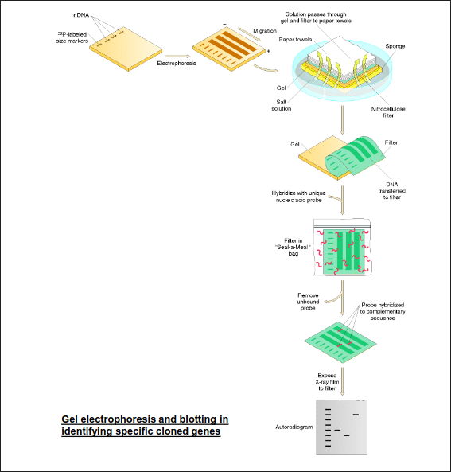
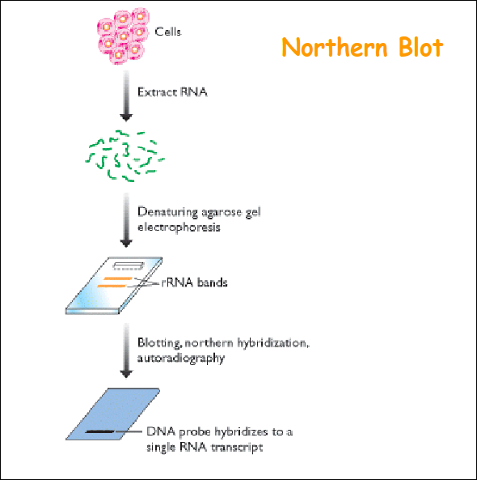
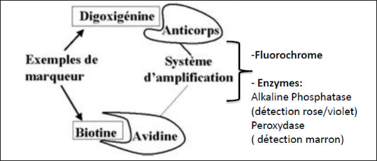
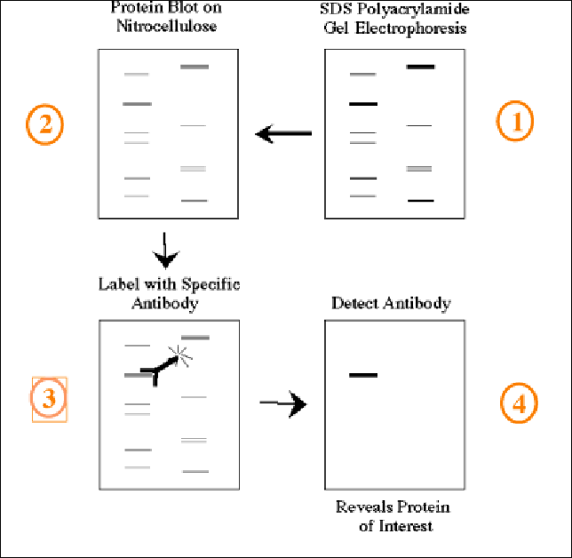
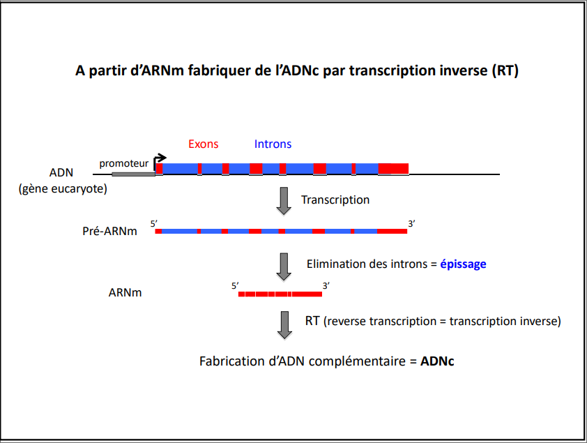
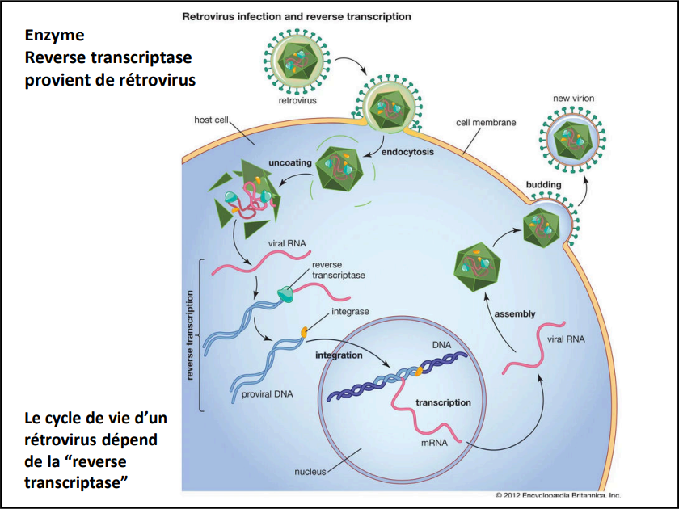
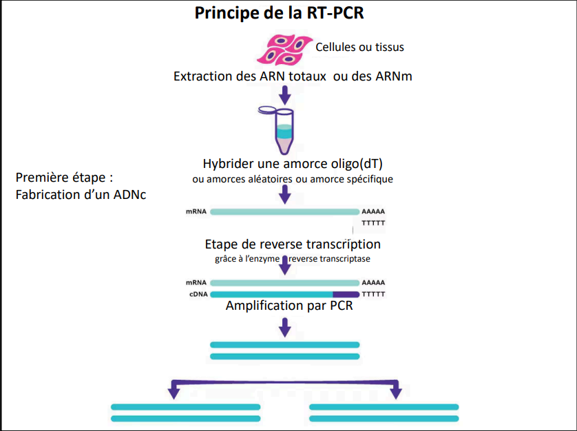
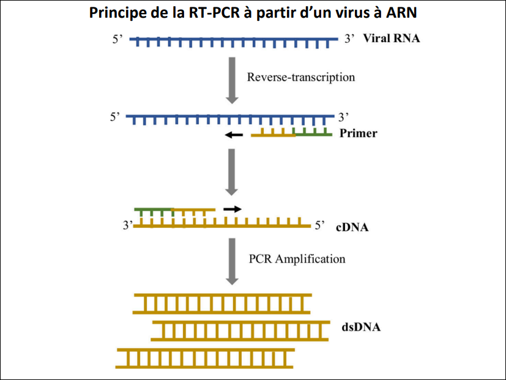
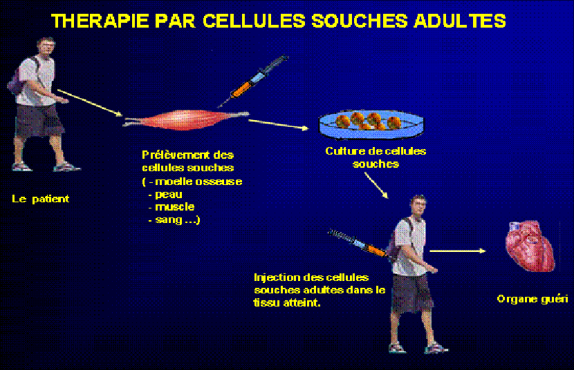

- >La ***Biologie moléculaire*** est une discipline scientifique de la vie au croisement de la génétique, de la biochimie métabolique et de la physique, dont l'objet est la compréhension des mécanismes de fonctionnement de la cellule au lvl moléculaire
  >le ***génie génétique*** est l'ensemble des outils permettant de modifier la constitution génétique d'un organisme en supprimant, introduisant ou remplacant de l'ADN
  >Les ***Biotechnologies*** sont l'ensemble des techniques qui mettent en oeuvre des organismes vivants pour l'industrie
-
- # ***1) Le clonage moléculaire***
- Le ***clonage*** désigne une *multiplication à l'identique* (conservation parfaite de l'info génétique):
	- A l'échelle moléculaire => ***clonage moléculaire***
	  logseq.order-list-type:: number
	- A l'échelle cellulaire => ***clonage cellulaire***
	  logseq.order-list-type:: number
	- A l'échelle de l'organisme entier => ***clonage reproductif***
	  logseq.order-list-type:: number
	- Le ***clonage moléculaire*** est une des techniques de base du génie génétique. Elle consiste à amplifier des quzntités importantes d'ADN d'intérêt (par ex, un gène ou partie de gène que l'on veut étudier)
	- Pour cela, on insère un fragment d'ADN d'intérêt (par ex, que l'on veut étudier) dans un vecteur (ex: plasmide)
-
- **Génie génétique ou technologie de l'ADN recombinant repose sur:**
	- Le code génétique est le même pour tous les êtres vivants
	- cette caractéristique permet le transfert de gènes d'un espèce à l'autre = ***génie génétique***
-
- ### PRINCIPE:
	- ***Organisme donneur***: extraction d'un fragment d'*ADN d'intérêt*
	- ***Vecteur:*** fragment d'ADN capable de réplication autonome
		- => Insertion du **fragment d'intérêt** dans le *vecteur*
		- => Obention d'un **ADN recombinant**
		- => Amplification de l'ADN
		-
-
- ***1.1: Enzymes de restriction***
	- 1962, *enzymes de restriction* Arber, Smith et Nathan, prix Nobel 1978 pour l'invention du génie génétique
	- La découverte et la caractérisation des enzymes de restriction a permis le developpement de la technologie de l'ADN recombinant
	- Les enzymes de restriction sont produites par des bactéries et agissent comme des ciseaux en coupant l'ADN au lvl des séq. cibles spécifiques.
	-
	- Fabriquées par les *bactéries*
	- reconaissent classiquement des séquences de **nucléotides** (4 à 8 pour celles utilisées en biomol)
	- classe des **endonucléases**
	- mécanisme de **défense** vs les infections par les bactriophages
	- protection des séq identiques chez les bact. par **méthylation**
	- **> 100** actuellement utilisables en biomol
	-
	- Une enzyme de restriction clive l'ADN sur les 2 brins au lvl de son site de reconnaissance
	- Elle coupe l'ADN au lvl des liaisons phosphodiester
	- #### ***Caractéristiques des enzymes de restriction***
		- Les séquences reconnues (4-8pb) sont symétriques: *séquences palindromiques*
	- Fréquence de coupure:
		- 4 bases: 4⁴ = 256 nases
		- 6 bases: 4⁶ = 4096 bases
		- 8 bases: 4⁸ = 65,536 bases
-
- #### ***Vecteur:***
	- Structure biologique capable de complexer une macromolécule et de l'intégrer spécifiquement dans une cellule vivante.
	- En biomol, les ***vecteurs*** sont étudiés pour faire entrer un acide nucléique dans une cellule et de permettre la réplication et parfois l'expression de cet acide nucléique dans la cellule qui le reçoit.
	- ***Génralités sur les vect. de clonage:***
		- grande diversité:
			- *plasmides:* très souvent uilisés, réplication dans les bact. (ex du cours)
			- bactériophages
			- cosmodes
			- chromosomes artificiels de levure (YAC) et de bact. (BAC)
	- **Propriétés des vect de clonage:**
		- capacité de replicatiob autonome dans une cell hote donnee
		- capacité d'insetion d'un fragment d'ADN plus ou moins grand
		- possession d'un site de clonage multiple pour l'insertion du fragment d'ADN (correspond a différents sites uniques de restricion = sites ou le vecteur peut etre ouvert)
		- présence d'un marqueur (ou +) de sélection (gène de résistance a un antibio, marqueur de selection metabolique)
		-
		- Fragments de restriction:
			- fragments d'ADN obtenus par action des enzymes de restriction
			- => Analyse et purification du fragment d'ADN par electrophorèse en gel
		-
		- ***L'electrophorese*** est une methode de separation des particules chargees electriquement par migration différentielle sous l'action d'un champs electrique. Elle s'applique aux: acides nucleiques, nucléptides, prots, peptides, acides aminés
		- La migration dépend de la chrge et de la géométrie des particules, ici la taille des fragments d'adn
		- l'electrophorese peut se faire sur un supp homogène, poreux et relativement inerte (papier, gels...) pour l'adn sur du gel d'agarose (ou acrylamode)
		- **Etape de liaison**
			- La *ligase* est une enzyme capable de lier de facon covalente 2 mol d'adn
		- L'ensemble formé par un vecteur et un ou + fragments insérés appelé adn recombinant est ensuite utilisé pour ***Transformer*** des cell. bactériennes
		- en general, il penetre une seul molecule de vecteur recombinant par cellule bact.
		- Ces cell sont etalees et se multiplient en formant des colonies
		- Par csq, une colonie contient une population tres importnte d'inserts identiques d'ADN, et on appelle cette population un clone d'ADN
		- Cas d'un **vecteur plasmique**: l'ADN est introduit dans des bactéries traitées spécialement le plus souvent par choc thermique ou par choc electrique (électroporation)
		- Il s'agit de l'étape dite de ***Transformation***
		-
		- ensemble d'une colonie de bacteries transformees dans un milieu nutritif liquide contenant l'antibiotique permettant la selection et amplification des bacteries une nuit a 37 degres sous agitation
		- => multiplication des bactéries donc amplification du nb de plasmides recombinés (presence d'une origine de replication bactérienne sur le plasmide, l'antibiotique assure une pression de selection pour que les bact. consevent le plasmide)
		- Il faut ensuite recuperer le plasmide
		- ***Extraction des bacteries de l'adn d'interet***
			- les bacteries sont **lysées** par un detergent en **milieu alcalin** afin de **libérer l'adn** génomique et plasmidique
			- l'adn génomique et les prots sont precipitees par de **l'acetate de sodium**. Le precipité est separe par centrifugation, le surnageant contient l'adn plasmidique.
			- **L'adn plasmidique est alors précipité** (volume double d'ethanom ou isopropanol), lavé puis redissous dans un tampon aqueux
	- #### ***En résumé:***
		- **Clonage moléculaire**
			- couper l'ADN d'intérêt et le vecteur a l'aide *d'enzymes de restriction*
			  logseq.order-list-type:: number
			- relier les molécules d'adn (adn donneur-vecteur): *ligation*
			  logseq.order-list-type:: number
			- *amplifier l'adn recombinant* à l'aide de la machinerie de la cellule hôte du vecteur (c'est la bact si le vect est un plasmide)
			  logseq.order-list-type:: number
- # ***2) Technique d'amplification d'ADN par PCR***
	- ***prix nobel de chimie*** attribué à Michael Smith et Kary Mullis en ***1993***
	- la méthode PCR permet de multiplier plusieurs millions de fois un segment isolé d'ADN
	- cette operation peut etre realisee en environ 1h dans un tube *(in vitro)*
	- elle a détroné le "clonage moléculaire" par bactéries, infiniment plus long et qui nécéssite un matériel génétique de départ plus important
	- l'amplification (= copie d'adn) est realisee ***in-vitro***
	- on obtient un fragment d'ADN de ***longueur définie***
	- pour pouvoir copier chaque brin d'adn, une ***dissociation*** des 2 brins de l'ADN à zmplifier est nécéssaire
	- l'enzyme nécéssite une ***amorce*** pour copier ***chaque brin*** de l'adn a amplifier
	- ### ***L'enzyme resp. de la copie***
		- A l'origine extraite de *Thermus aquaticus*, une bactérie ***thermophile*** (résiste a des temp tres elevees)
		- Cette bacterie est equipee d'enzymes, non seulement résistante aux autes temperatures, mais dont l'activité est optimale a ces temperatures
		- Parmi ces enzymes, l'ADN polymérase, la Taq (***T***hermo ***aq***uaticus) polymérase, résistante à l'ébullition et active 72\deg\C
		- pas la seule  mais la plus utilisée
	- La copie se fait dans le sens 5' => 3'
	- ### ***Les amorces***
		- Un pré-requis essentiel est de connaitre les seq aussi exactes que possible situées aux 2 extrémités du ***fragment d'intérêt***
	- ### ***La réaction***
		- *l'ADN cible*
		- les *2 amorces* oligonucléotidiques monobrins complémentaires chacune d'une des extrémités du fragment à amplifier
		- des *désoxynucléotides libres* dATP, dCTP, dGTP, dTTP (dNTP) qui sont incorporables dans le brin d'ADN néosynthétisé
		- l'ADN *polymérase* thermostable
		- du $MgCl_2$ et une *solution tampon* donnant au milieu reactionnel un pH et une concentration saline optimale pour le fonctionnement de l'enzyme
		- *repetition de cycles* dont chacun comprend:
			- la *dénaturation*: tous les brins d'adn sont dissociés par la chaleur
			- l'*hybridation* des amorces sur un fragment d'ADN
			- l'*extension*: *synthèse* des brins à partir des amorces hybridées
	- ### ***Principes de l'hybridation***
		- L'hybridation moléculaire est:
			- ***Spécifique***: sous certaines conditions expérimentales (**stringence**), une séq d'adn monobrin ne peut s'apparier qu'à la seq qui lui est complémentaire dans le génome
			- ***réversible***: l'expérimentateur peut, en jouant sur les conditions expérimentales (essentiellement la \theta du milieu de réaction) réaliser ou au contraire supprimer (dissocia\deg) l'hbridation de 2 molécules d'ADN
		- L'appareil de PCR s'appelle un *thermocycleur*
		- Il est programmable en temps et en \theta, et disposant de délais de montée et de descente de \theta extrêmement courts. Il délivre a chaque instant au milieu reactionnel une \theta donnée permettant la réalisa\deg de l'une des 3 etapes du cycle de PRC: dénaturation, hybridation ou synthèse
	- ### ***Applications de la PCR***
		- elles sont tres nombreuses
		- quelques exemples:
			- *Analytiques:* analyse quantitative de la presence, taille ou sequence de fragment d'ADN ou ARN. Analyse quantitative plus difficile.
			  logseq.order-list-type:: number
			- Aide au clonage en s'affranchissant des limites imposées par les enzymes de restriction
			  logseq.order-list-type:: number
			- *technologies:* création de mutants grâce à l'utilisation d'oligonucléotides dégénérés
			  logseq.order-list-type:: number
		- tres couramment utilisés dans de nombreux domaines:
			- *biomol* pour amplifier un fragment d'ADN
			  logseq.order-list-type:: number
			- travaux de *recherche fondamentale*
			  logseq.order-list-type:: number
			- *biotechnologies*
			  logseq.order-list-type:: number
			- *médecine:*
			  logseq.order-list-type:: number
				- diagnostiques des maladies génétiques (myopathie, mucoviscidose, ...) 
				  logseq.order-list-type:: number
				- diag des maladies infectieuses: virales (SIDA, Hép C, SRAS, corona) ou bact (tuberculose) ou parasitaires (toxoplasmose)
				  logseq.order-list-type:: number
				- diag d'anomalies génétiques: \neq mutations dans le cancer et autres affections
				  logseq.order-list-type:: number
			- En *médecine légale:* identifier une personne par son empreinte génétique (enquête judiciaire)
			  logseq.order-list-type:: number
			- test de *paternité*
			  logseq.order-list-type:: number
			- en *agroalimentaire*
			  logseq.order-list-type:: number
				- pour identifier des varietes ou especes (veg, animales, pour selectionner de nlles varietes de fruits et legumes comme la tomate)
				  logseq.order-list-type:: number
				- pour le ctrl de qualite des produits agroalim (detecter la presence d'OGM)
				  logseq.order-list-type:: number
			- en *histoire*
			  logseq.order-list-type:: number
				- pour faire des etudes phylogénétiques (squelettes fossiles = ADN fossile, rechercher des liens de parenté entre les individus)
				  logseq.order-list-type:: number
				- etude des migrations des populations humaines et animales (pop en islande, indiens d'amerique....)
				  logseq.order-list-type:: number
				- pour detecter des infections virales, bacteriennes et parasitaires sur des momier egyptiennes et andines (ex: virus HTLV-1 present dans des momies de la cordilliere des andes dartant des plus de 1500 ans)
				  logseq.order-list-type:: number
			- en 1992, la techniques est amelioree via l'utilisation de molecules fluorescentes.
			- Grâce a la fluorescence qui résulte de la fixation de la molécule sur l'ADN, la cinétique d'accumulation de la fluorescence est reliee au noombre de copies initiales d'ADN "Real-Time QPCR"
- # ***3) Techniques de détection des séquences d'ADN, d'ARN et de protéines***
	- ***Hybridation*** d'acidess nucléiques ou protéines
	- **notion de complémentarité: reconnaissance moléculaire**
	  logseq.order-list-type:: number
		- complémentarité de séquence => d'acides nucliques
		  logseq.order-list-type:: number
		- ou de structure => protéines
		  logseq.order-list-type:: number
	- **complexe sonde-cible (hybride)**
	  logseq.order-list-type:: number
		- ADN-ADN (sonde = complémentaire antiparallèle)
		  logseq.order-list-type:: number
		- ADN-ARN
		  logseq.order-list-type:: number
		- protéine-protéine (complexe Ac/Ag)
		  logseq.order-list-type:: number
	- **l'hybridation est spécifique (sonde / cible)**
	  logseq.order-list-type:: number
		- a lieu même en presence d'un large exces de molecules similaires mais non identiques
		  logseq.order-list-type:: number
	- **differentes techniques pour les acides nucléiques:**
		- southern-blot
		- nothern-blot
		- dot-blot
		- tech d'hybridation *in situ*
		- PCR
		- RT-PCR
	- **objectif:** détention d'une molécule d'ADN ou ARN dans un mélange en contenant des milliers
	- ## ***southern-blot***
	  id:: 65fc7b0e-6f79-44b0-bb78-1e50b28e88be
		- 
		- ***but:*** detecter la presence des sequences d'ADN specifiques dans un melange
		- ***Edwin Southern*** eut l'idee de transferer des fragments de restriction separes dans un gel, sur une membrane susceptible de subir le traitement d'hybridation (1975)
		-
		- ***applications:***
			- **identification de mutations** w/ \neq enzymes:
			  logseq.order-list-type:: number
				- detecion de ré-arrangements (délétions ou insertions)
				  logseq.order-list-type:: number
				- differentier forme sauvage et mutante d'un gène (hybridation avec sonde "sauvage" et "mutante") --> ADN foetus anormal ne s'hybridera qu'avec la sonde mutante
				  logseq.order-list-type:: number
			- **identification des genes d'un parent éloigné**
			  logseq.order-list-type:: number
				- hybridation a faible spécificité (permet appariement même imparfait)
				  logseq.order-list-type:: number
				- ex: identification de nlles familles de regulateurs du developpement embryonaire chez la drosophile, membre de ctte famille presente chez l'homme
				  logseq.order-list-type:: number
			- aujourd'hui, le southern blot peut etre remplacé par la PCR pr repondre aux memes questions experimentales
	- ## ***Nothern blot***
	  id:: 66152f1e-b87f-43be-97e2-a2b8121e2766
		- 
		- Même princime que le SB mais ici ce sont les ***ARN*** qui st étudés (ps de digestion préalable mais traitement au formaldéhyde pour casser les structures secondaires des ARN)
		- #### ***Applications:***
			- apprécier la distrivution d'un ARN dans les tissus, étiduer son abondance relative => permet d'étudier le niveau d'expression d'un gène et son territoire d'expression
			- Aujourd'hui, le Northern Blot est souvent remplacé par la RT-PCR (voir ci-après)
			- déterminer la taille d'un ARN
			- détecter les intermédiaires de maturation et les différentes formes d'épissage de l'ARN
		- ### ***Nature des sondes acides nucléiques;***
			- **Fragments d'ADN ou ARN marqués**
				- sondes radioactives froides / chaudes (incorporation de nucléotides radioactifs)
				- *sonde froide*
			- **Générée in vitro avec une séquence complémentaire de la séquence recherchée**
				- fragment de restriction
				- produit PCR
				- Oligonucléotide de synthèse
			- ### ***Marquage des sondes froides***
				- **Sonde directement marquée:**
					- incorporation d'un nucléoride directement marqué par un fluorochrome
				- **Sonde indirectement marquée:**
					- -> Incorporation d'un haptène à détecter secondairement:
						- biotine révélée par l'avidine / streptavine couplée è in fluorochrome ou à un enzyme
						- dioxygénine (DIG) dévélée par un anticorms anti-DIG couplée à un fluorochrome ou à une enzyme
						- 
	- ## ***Dot blot***
		- ĉ ((65fc7b0e-6f79-44b0-bb78-1e50b28e88be)) mais ss séparation de l'ADN sur gel (ou ĉ ((66152f1e-b87f-43be-97e2-a2b8121e2766)) pour des ARN, ou WB pour prots)
		-
	- ## ***Western-Blot***
		- détecter la présence d'une *prot* dans un mélange grâce à un anticorps spécifique à celle-ci
		- 
		- ***sonde de type anticorps***
	- ## ***RT-PCR*** (reverse transcription PCR)
		- La RT-PCR est une technique qui permet de faire une pcr a partir d'un échantillon d'ARN
		- Permet d'évaluer **l'expression d'un gène** en détectant son **ARNm**
		- Après la synthèse de **l'ADN complémentaire (ADNc)**, on le osumet à l'amplification par PCR
		- ### ***préparation d'ADNc (complémentaire)***
			- la synthèse d'ADNc se fait à partir d'un ARNm grace a l'utilisation d'une transcriptase reverse
			- les transcriptases réverses sont des **ADN polymérases** qui peuvent synthétiser un brin d'ADNc (= cDNA) en prenant un **ARN comme matrice**
			- 
			- 
			- 
			- 
- # ***4) notion de biotechnologie***
	- ## ***préparation de protéines recombinantes***
		- > planche ici (production prot recmbinnte)
		- ### ***vecteurs d'expression***
			- vecteur possédant une région permettant ***l'insertion*** d'une **séq codante** d'un gène entre des **séq indispensables à son expression dans la cellule hôte**
			- càd un ***promoteur***, et une **séq terminatrice** de la transcription reconnus par la cellule hôte
			- > planche ici (exemple de vecteur plasmidique d'expression protéique)
		- {{video https://www.youtube.com/watch?v=XoDY9vFAaG8&pp=ygUgb24gcydlbiBiYXQgbGVzIGNvdWlsbCBmb25kIHZlcnQ%3D}}
		- Dans le cas de la **synthèse d'une protéine** provenant d'un organisme **eucaryote** chez les bact
			- nécéssite de **ne pas avoir les séq introniques** (introns) dans la séquence du gène dans le vecteur d'expression
			- nécéssite de cloner la **séq en aval d'un promoteur bactérien** *(si plasmide bactérien)*
		- > planche ici (suite des etapes cDNA)
		- les **bactéries** dans bcp de cas **répondent aux exigences**
			- > l'une des premières applications: E.comi **d'hormones de croissance bovine recombinante (rbGH)**
			- d'autres prots importantes sur le plan agricole ont été produits par des bactéries
			- par ex des **vaccins vs le virus de la fièvre aphteuse** (prot d'enveloppe)
		- mais aussi des protéines (**enzymes**) pour **l'agro-alim**.
			- utilisation des MGMs (microorganismes génment mdifiés) pr prod != enzymes
			- nbreuses commercialisées (> 40)
			- ex:
				- amylases
				- acétolases décarboxylases
				- aspartyl protéases
				- hémicellulase, xylanase, lipase
				- pullanase
				- endoxylanase
				- chymosine
		- cependant bcp de prots doivent subir divrses **modifications post-traductionnelles** pour ê actives
		- ces modifications peuvent etre:
			- formation de ponts disulfures
			- glycosylation
			- méthylation
			- clivages spécifiques
			- etc
		- seules les **cellules eucaryotes supérieures** peuvent procéder à ces modifications
		- > planche ici: vecteur d'expression eucaryote
		- ainsi, **culture de lignées de cell d'eucaryotes supérieures** exprimant une protéine étrangère est utilisée pour des préparations à l'échelle industrielle
		- par ex:
			- l'érythropoïteine humaine
			- le vaccin vs l'hépatite B
			- facteur VIII humain de coagulation
			- ...
		- cultures **coûteuses** car cellules relativement fragiles
		- ## ***utilisation d'animaux transgéniques comme source de protéines recombinantes***
		- technique de micro-injection de l'ADN dans un ovule fécondé
		- > planche ici: animaux transgéniques
- # ***préparation d'organes***
	- la préparation de cellules et d'organes pour la transplantation à l'homme
	- organes greffés ches espèce étrangère: soumis à un **rejet suraigu létal**
	- des anticorps naturels de l'hôte reconnaissent des antigènes des cellules de greffon
	- ceci conduit à une **activation du complément** qui détruit les cellules endothéliales et provoque des thromboses locales
	- > planche ici: tissu donné d'un porc
	- > planche ici: xénotransplantation
- 
- # ***Cellule souche adulte***
	- Source : tissu adulte spécialisé
	- capacité d’auto-renouvellement
	- capacité à générer des cellules spécialisées
	- unipotente (un type de cellules spécialisées) ou multipotente
	- (plusieurs types de cellules spécialisées)
	- But thérapeutique:
		- Réparer une fonction déficiente
		- Reconstitution du tissu d’origine (moëlle osseuse, peau,
		  cartilage, muscle, neurones…)
-
-